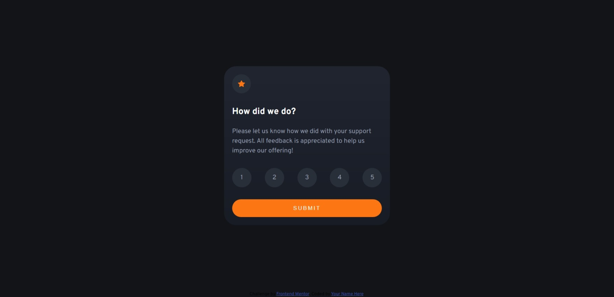
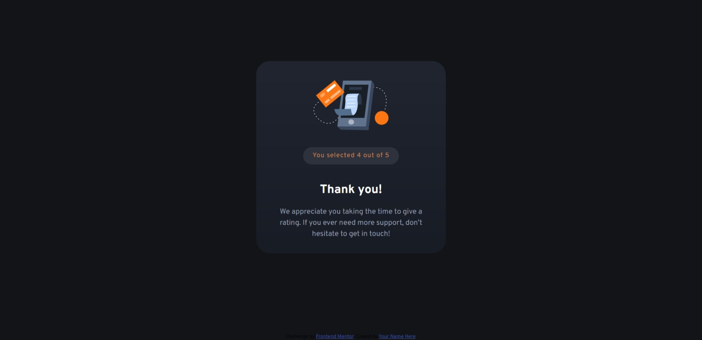

# Frontend Mentor - Interactive rating component solution

This is a solution to the [Interactive rating component challenge on Frontend Mentor](https://www.frontendmentor.io/challenges/interactive-rating-component-koxpeBUmI). Frontend Mentor challenges help you improve your coding skills by building realistic projects.

## Table of contents

- [Overview](#overview)
  - [The challenge](#the-challenge)
  - [Screenshot](#screenshot)
  - [Links](#links)
- [My process](#my-process)
  - [Built with](#built-with)
  - [What I learned](#what-i-learned)
  - [Continued development](#continued-development)
  - [Useful resources](#useful-resources)
- [Author](#author)
- [Acknowledgments](#acknowledgments)

## Overview

### The challenge

Users should be able to:

- View the optimal layout for the app depending on their device's screen size
- See hover states for all interactive elements on the page
- Select and submit a number rating
- See the "Thank you" card state after submitting a rating

### Screenshot

### Links

- Solution URL: [Add solution URL here](https://github.com/SaidAoussar/interactive-rating-component)
- Live Site URL: [Add live site URL here](https://saidaoussar.github.io/interactive-rating-component/)

## My process

### Built with

- Semantic HTML5 markup
- Flexbox
- Mobile-first workflow
- Sass

**Note: Delete this note and the content within this section and replace with your own learnings.**

### Continued development

Use this section to outline areas that you want to continue focusing on in future projects. These could be concepts you're still not completely comfortable with or techniques you found useful that you want to refine and perfect.

### Useful resources

- [w3schools](https://www.w3schools.com/)
- [MDN Web Docs](https://developer.mozilla.org/en-US/)
- [stackoverflow](https://stackoverflow.com/)

## Author

- Website - [Said Aoussar](https://saidaoussar.tech/)
- Frontend Mentor - [@SaidAoussar](https://www.frontendmentor.io/profile/SaidAoussar)
- Twitter - [@SaidAoussar1](https://twitter.com/SaidAoussar1)
